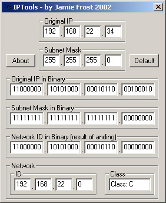



## IP Tools 1\.0 Basic IP thingy \- take a look

### Description

This code, aside from being totally useless is a learning tool. I wrote it for my IT intro to networking class, to illustrate the process of 'anding' (no, thats not a typo) a TCP/IP IP with its subnet mask to determine the Network ID and Network Class. Its got lots of 'dumb user' pitfall watches like checking for people typing words in number feilds etc. Also 'included' in this miracle program is the ability to use "." to tab between fields, in a custom built taborder.

In order to keep proper coding standards, I ended up with LOTS of subs, each only operating on very small tasks, to keep the code simple.

Take a look, you may like it, you may not, its totally useless (unless you need to learn about network ID's), but a good example of good coding standards, if nothing else.

How it works:

Short and sweet - to determine what network your computer is on, it uses a network ID, derrived from your IP and your subnet mask.

To put the two together, you first convert each octet (part of the IP and Mask) into binary seperately.

Then, one by one you go through bit 1 of octet 1 of each the IP and Mask, and use an 'or' on them, if either is a 1, then the resulting bit will be 1.

After all the bits have been anded, then they get converted back into decimal, resulting in the Network ID. if you didnt understand that, dont worry, I wrote this program BECAUSE my classmates didnt understand it.

feel free to vote, although (obviously) not nessecary. I just want to get a scope of what people think of it.
 
### More Info
 
A valid network IP and a subnet mask.

Short and sweet - to determine what network your computer is on, it uses a network ID, derrived from your IP and your subnet mask.

To put the two together, you first convert each octet (part of the IP and Mask) into binary seperately.

Then, one by one you go through bit 1 of octet 1 of each the IP and Mask, and use an 'or' on them, if either is a 1, then the resulting bit will be 1.

After all the bits have been anded, then they get converted back into decimal, resulting in the Network ID. if you didnt understand that, dont worry, I wrote this program BECAUSE my classmates didnt understand it.

The network ID resulting from anding the inputs, in decimal and binary.

             |
---                |---
**Submitted On**   |2002-08-22 02:05:50
**By**             |[Emperor Frollard](https://github.com/Planet-Source-Code/PSCIndex/blob/master/ByAuthor/emperor-frollard.md)
**Level**          |Intermediate
**User Rating**    |4.5 (18 globes from 4 users)
**Compatibility**  |VB 6\.0
**Category**       |[Complete Applications](https://github.com/Planet-Source-Code/PSCIndex/blob/master/ByCategory/complete-applications__1-27.md)
**World**          |[Visual Basic](https://github.com/Planet-Source-Code/PSCIndex/blob/master/ByWorld/visual-basic.md)
**Archive File**   |[IP\_Tools\_11209778222002\.zip](https://github.com/Planet-Source-Code/emperor-frollard-ip-tools-1-0-basic-ip-thingy-take-a-look__1-38173/archive/master.zip)

### API Declarations

none

